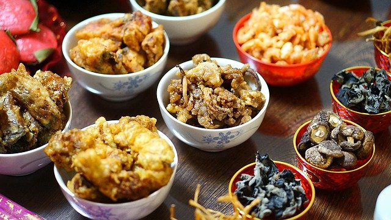
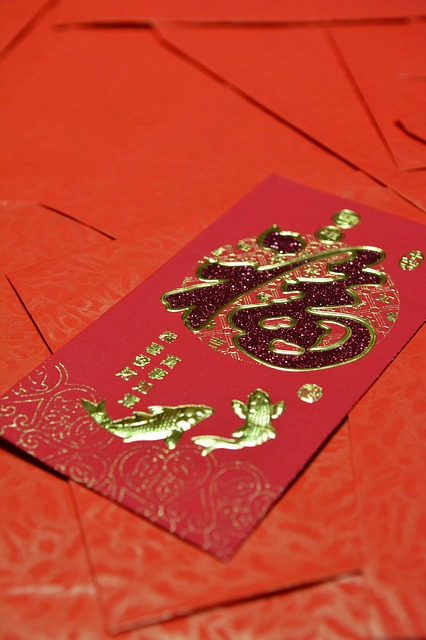

Title: Chinese New Year 2021 (Year of the Ox)
Image: images/chinese-decoration-ox.jpg
Published: 2/12/2021
Tags: 
- Mandarin
- Chinese
- Chinese New Year
---
# 新年快樂 (xīnnián kuàilè： Happy New Year)

Happy new year! as the year of the Rat comes to an end it's now time for the year of the Ox. In this blog post I'll go over what Chinese New Year is and some of the traditions I have experienced during festival. 

> 

## What is Chinese New Year?

Most commonly known as Chinese New Year or Lunar New Year is one of the most oldest and important celebrations in the Chinese calendar. Festivities last until the following full moon which is why it is sometimes called Lunar New Year because the dates of the festival follow the phases of the moon. In the West Christmas is the biggest holiday followed, but in many Chinese communities Chinese New Year is the biggest holiday. It is during this time that people are given 7 days off work and during this time many people will travel back to their families to spend time with them or families will use this time to also go on holiday.

## Origins

It is said thousands of years ago a monster named Nian (Year) would attack villagers at the beginning of each new year. The monster was afraid of the color red, bright lights and loud noises, so it was these things that were used to chase the beast away. This is one of the reasons during this time you will see many red decorations, fireworks and firecrackers being set off.

## Chinese New Year's Eve

As previously mentioend Chinese New Year is a time that family get together and on the eve of the festival families will have a big dinner called the reunion dinner which is to be considered the most important meal of the year. Also the food that is ate during this occasion carries symbolism which I have previously written in this post: [Food Symbolism during Chinese New Year](/posts/food-symbolism-during-chinese-new-year).

> 

## 紅包 (Hóngbāo: Red envelope)

Red envelopes containing money are usally given as gifts during Chinese New Year. Red is regarded as a the symbol of energy, happiness and good luck. It customarily for 紅包 to be given to children and retired people within the family.

> 

## Lantern festival 

Latern festival is traditionally the last day of the CNY festival. It is during this time that many lanterns will be put on display of all shapes and sizes.  

> 
